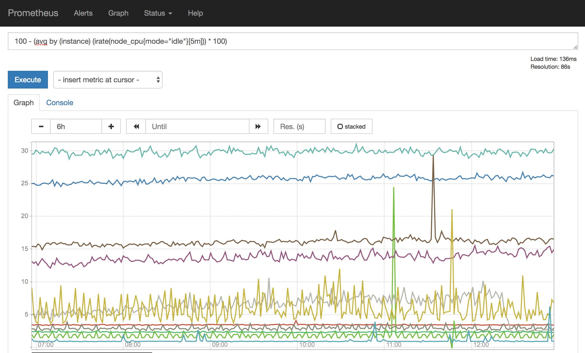

This project describes deploying a Prometheus Pod into an OKD namespace to monitor Prometheus metric compatible services. Services should be able to collect telemetry from application internals as well as network requests in order to help SRE's measure performance and react when services are alarming. The OKD installed [Grafana](https://prometheus.io/docs/visualization/grafana) is configured with an additional Data Source to connect to the Prometheus Pod and ingest the metrics continuously.